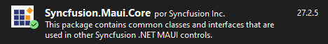

//Definition of the project, goals and what it is hoped to accomplish
To make the light/dark theme change work you need the following steps

You need to install Syncfusion.Maui.Core

Add to the App.xalm the following lines

The feature should work now